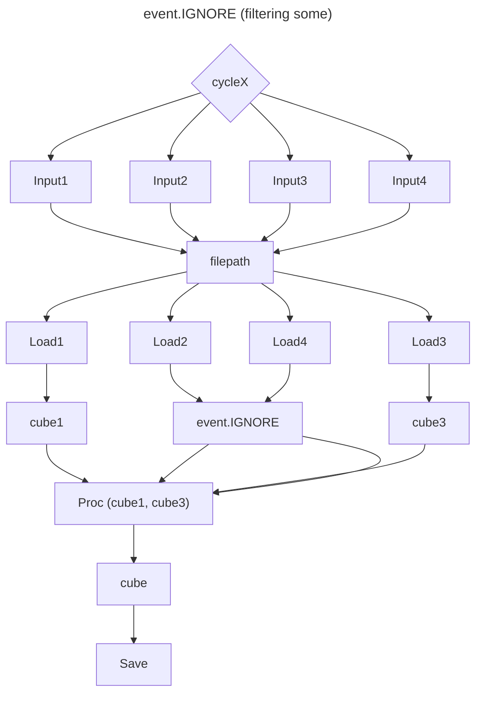
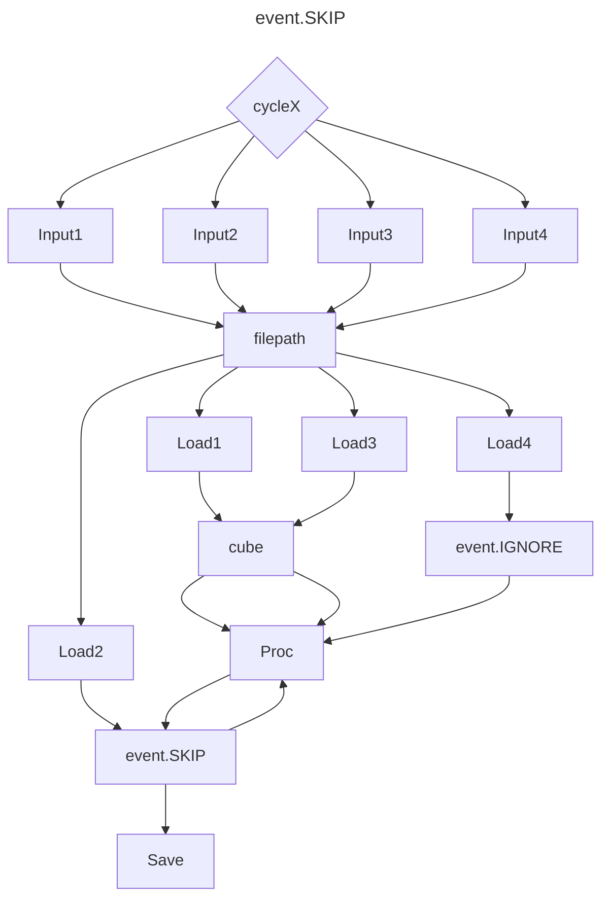

# module: `dagrunner.events`

[Source](../dagrunner/events.py#L0)

## Overview
DAGrunner defines two special singleton events that plugins can return to control the
execution flow of their graph.

- event.IGNORE - removes a particular input from further processing.
- event.SKIP -  aborts the execution of a plugin (and all downstream nodes) when any
  input carries this event.

### event.IGNORE
When a plugin returns `event.IGNORE`, the immediate descendant node filters out that
input.
The remaining inputs of that plugin are utilised by that node as normal.
If all inputs to a node are `event.IGNORE`, the node's execution is skipped, and a
`event.SKIP` event is returned instead, skipping execution through all descendants.

Here, Input2 and Input4 return an IGNORE event, likely due to there being missing data.
Only the non-ignored cubes (`cube1` and `cube3`) reach `Proc`; the ignored inputs are
dropped.

### `event.IGNORE`
The SKIP event differs from the IGNORE event in that if **any** input to a plugin is a
SKIP event, node execution is skipped and it instead propagates this skip event so that
all dependent nodes and their descendants aren't executed.

Because `Input2` returns a SKIP event, the Proc node and everything that follows aren't
executed and neither is the Save node since the skip is propagated along the execution
graph.

see [class: dagrunner.utils.Singleton](dagrunner.utils.md#class-singleton)

## _IgnoreEvent: `IGNORE_EVENT`

## _SkipEvent: `SKIP_EVENT`

