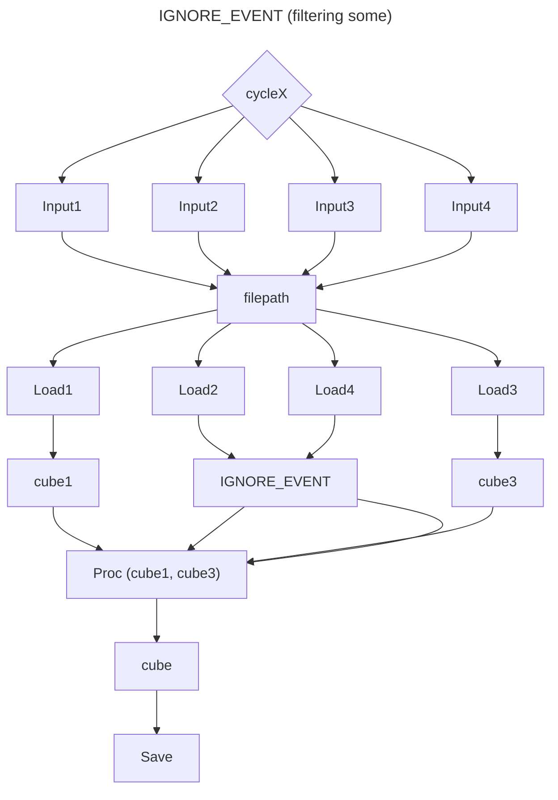
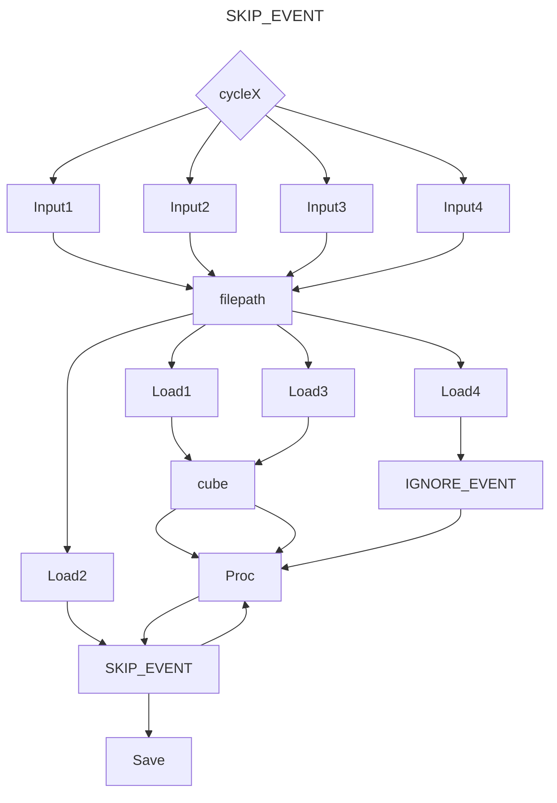

# module: `dagrunner.events`

[Source](../dagrunner/events.py#L0)

## Overview
DAGrunner defines two special singleton events that plugins can return to control the
execution flow of their graph.

- IGNORE_EVENT - removes a particular input from further processing.
- SKIP_EVENT -  aborts the execution of a plugin (and all downstream nodes) when any
  input carries this event.

### _IgnoreEvent: `IGNORE_EVENT`
When a plugin returns `IGNORE_EVENT`, the immediate descendant node filters out that
input.
The remaining inputs of that plugin are utilised by that node as normal.
If all inputs to a node are `IGNORE_EVENT`, the node's execution is skipped, and a
`SKIP_EVENT` event is returned instead, skipping execution through all descendants.

```mermaid
---
title: IGNORE_EVENT (filtering some)
---
graph
    cycle1{cycleX}
    cycle1 --> Input1 --> filepath --> Load1 --> cube1 --> Proc
    cycle1 --> Input2 --> filepath --> Load2 --> IGNORE_EVENT --> Proc
    cycle1 --> Input3 --> filepath --> Load3 --> cube3 --> Proc
    cycle1 --> Input4 --> filepath --> Load4 --> IGNORE_EVENT --> Proc
    Proc --> cube --> Save
    Proc["Proc (cube1, cube3)"]
```
Here, Input2 and Input4 return an IGNORE event, likely due to there being missing data.
Only the non-ignored cubes (`cube1` and `cube3`) reach `Proc`; the ignored inputs are
dropped.

### _SkipEvent: `SKIP_EVENT`
The skip event differs from the ignore event in that if **any** input to a plugin is 
`SKIP_EVENT`, node execution is skipped and it instead propagates this skip event so that
all dependent nodes and their descendants aren't executed.

```mermaid
---
title: SKIP_EVENT
---
graph
    cycle1{cycleX}
    cycle1 --> Input1 --> filepath --> Load1 --> cube --> Proc
    cycle1 --> Input2 --> filepath --> Load2 --> SKIP_EVENT --> Proc
    cycle1 --> Input3 --> filepath --> Load3 --> cube --> Proc
    cycle1 --> Input4 --> filepath --> Load4 --> IGNORE_EVENT --> Proc
    Proc --> SKIP_EVENT --> Save
```
Because `Input2` returns `SKIP_EVENT`, the Proc node and everything that follows aren't
executed and neither is the Save node since the skip is propagated along the execution
graph.

see [class: dagrunner.utils.Singleton](dagrunner.utils.md#class-singleton)